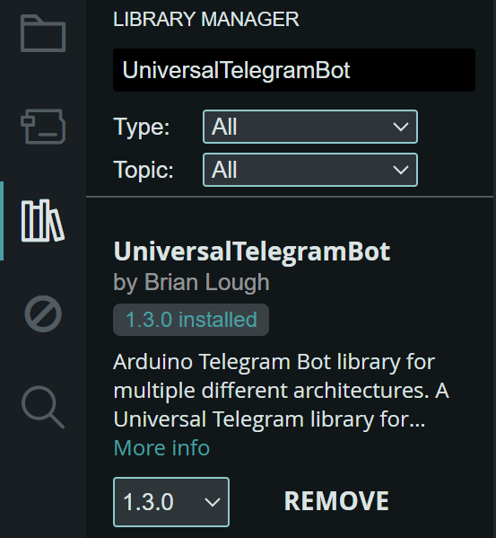
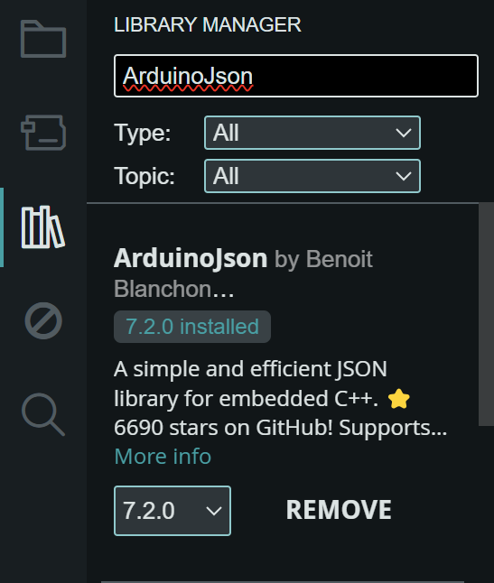
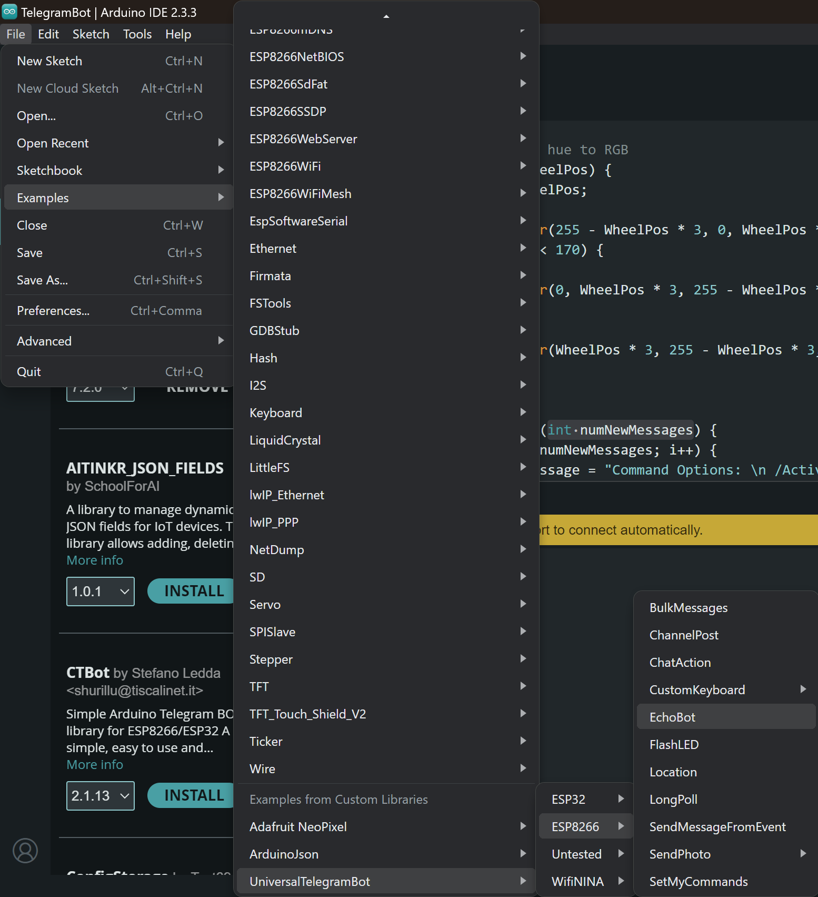
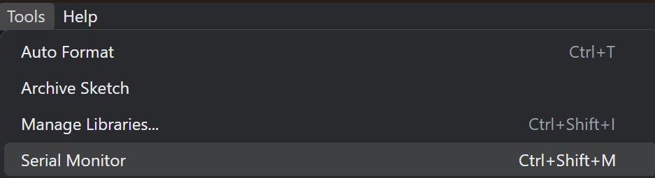

# Handleiding voor het aansturen van een NodeMCU via Telegram

## Inleiding

In deze handleiding leer je hoe je een NodeMCU kunt aansturen met Telegram. We maken gebruik van de Telegram Bot API om je NodeMCU te laten communiceren via Telegram. Volg de onderstaande stappen zorgvuldig.

> Als je ergens vast loopt kijk aan het einde van de handleiding voor de FME (Frequently Made Errors)

## Benodigdheden

- Een NodeMCU (ESP8266)
- Een computer met Arduino IDE geïnstalleerd
- Telegram-app op je smartphone
- Internetverbinding

## Stappen

### 1. Maak een Telegram-account aan

1. Installeer de Telegram-app op je smartphone.
2. Open de app en maak een account aan door je telefoonnummer te verifiëren.

### 2. Maak een bot aan via BotFather

1. Zoek in de Telegram-app naar de gebruiker **BotFather**. Dit is de officiële bot om nieuwe bots aan te maken.
2. Start een chat met BotFather en typ het commando `/newbot`.
3. Volg de instructies om je nieuwe bot een naam en gebruikersnaam te geven.
4. Na het aanmaken ontvang je een API-token (een lange reeks tekens). Noteer deze, want je hebt hem later nodig.

### 3. Installeer de benodigde bibliotheken in Arduino IDE

1. Open de Arduino IDE op je computer.
2. Ga links bovenin naar **Sketch** > **Include Library** > **Manage Libraries**.
3. Zoek naar **UniversalTelegramBot** en installeer deze bibliotheek.



5. Zoek naar **ArduinoJson** (door Benoit Blanchon) en installeer de laatste stabiele versie.



### 4. Voorbereiding van de Arduino-code

1. Open het voorbeeld **echobot** in de UniversalTelegramBot bibliotheek. Dit vind je onder **File** > **Examples** > **UniversalTelegramBot** > **esp8266** > **echobot**.



1. Pas de volgende waarden aan in de code:
   - **WiFi-gegevens**: Vul je SSID (Naam van het netwerk) en wachtwoord in tussen de `""` op de lijn waar `#define WIFI_SSID` staat.
   - **BOTtoken**: Vul het token in dat je van BotFather hebt ontvangen tussen de `""` op de lijn waar `#define BOT_TOKEN` staat.

### 5. Upload je code naar de NodeMCU

1. Sluit je NodeMCU aan op je computer via een USB-kabel.
2. Selecteer het juiste board en poort in de Arduino IDE via **Tools** > **Board** en **Tools** > **Port**.
3. Klik op de uploadknop om de code naar je NodeMCU te sturen.
   


### 6. Open de Serial Monitor

1. Open de Serial Monitor in de Arduino IDE via **Tools** > **Serial Monitor**.



1. In de Serial Monitor's bovenste balk aan de rechter kant moet je de baudrate instellen op **115200**.
2. Controleer of de verbinding met WiFi succesvol is. Je zou een melding moeten zien in de Serial Monitor dat de NodeMCU is verbonden.

### 7. Test de bot

1. Stuur een bericht naar je bot via Telegram. Typ iets en stuur het.
2. De NodeMCU zou het bericht moeten ontvangen en als een echo terugsturen naar Telegram.

### 8. Voeg functionaliteit toe

1. Zoek in de code naar de loop waarin de berichten worden verwerkt. 
   
   Deze zou moeten staan in de functie 
   
   ```cpp
   void handleNewMessages(int numNewMessages) 
   {
       ...
   }
   ```
   
   1.1 Voeg de volgende regel toe om het ontvangen bericht te printen:
   
   ```cpp
   Serial.println(bot.messages[i].text);
   ```
2. Je kunt nu slimme antwoorden toevoegen. Zo kan je andere teksten terug sturen door `"Message"` in zijn geheel te vervangen met iets tussen twee aanhalingstekens zoals `"Wat wil je dat ik doe?"`:
   
   ```cpp
   bot.sendMessage(bot.messages[i].chat_id, "Message", "");
   ```
   
   Dit verstuurt een automatisch antwoord naar de gebruiker.

### 9. Configureer de ingebouwde LED

1. Voeg de volgende regel toe in de `setup()` functie:
   
   ```cpp
   pinMode(LED_BUILTIN, OUTPUT); 
   ```

    Dit zorgt ervoor dat we de ingebouwde LED kunnen activeren en de-activeren

### 10. Voeg basisintelligentie toe

1. In dezelfde loop waar je de ontvangen berichten verwerkt, voeg een `if`-statement toe:
   
   ```cpp
   void handleNewMessages(int numNewMessages) 
   {
       if (bot.messages[i].text == "lights on") {
           digitalWrite(LED_BUILTIN, LOW); // Zet de LED aan
       } else if (bot.messages[i].text == "lights off") {
           digitalWrite(LED_BUILTIN, HIGH); // Zet de LED uit
       }
   }
   ```

### 11. Koppel je LED-strip

1. Sluit een LED-strip aan op de NodeMCU. Zorg ervoor dat je de juiste pinnen gebruikt.
2. Gebruik dezelfde logica als hierboven om de LED-strip aan en uit te schakelen via Telegram-commando's.

## Veelvoorkomende fouten en oplossingen

### Fout: Geen verbinding met WiFi

- **Oorzaak**: Verkeerde SSID of wachtwoord.
- **Oplossing**: Controleer je WiFi-gegevens in de code.

### Fout: Bot reageert niet

- **Oorzaak**: Verkeerd BOT-token of de bot is niet actief.
- **Oplossing**: Controleer of je de juiste BOT-token hebt ingevoerd en dat de bot is gestart in Telegram.

### Fout: Serial Monitor toont geen gegevens

- **Oorzaak**: Baudrate is niet goed ingesteld.
- **Oplossing**: Zorg ervoor dat de baudrate in de Serial Monitor is ingesteld op 115200.

## Bronnen

- [Telegram Bot API](https://core.telegram.org/bots/api)
- [Arduino Universal Telegram Bot](https://github.com/witnessmenow/Universal-Arduino-Telegram-Bot)
- [ArduinoJson](https://arduinojson.org/)
- [Handleiding Op DLO](https://icthva.sharepoint.com/:w:/s/FDMCI_ORG__CMD-Amsterdam/Eb7Jd27yWphMuVFbMHV_9WoBEg5_zqAQilsb6Q3gPSKueg?e=f5PM7l)

Volg deze stappen zorgvuldig en je zult succesvol je NodeMCU kunnen aansturen via Telegram!
